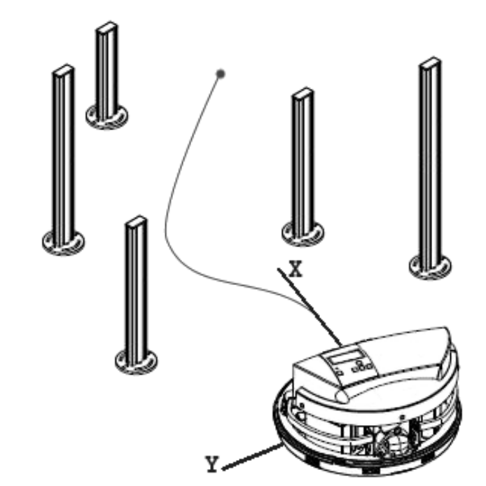

### Simple shared control method

The method takes data from lidar and user command represented as the desired speed vector from a joystick and 
changes this vector to prevent collisions with obstacles.

[Full description (rus)](docs/report_2015.pdf)

